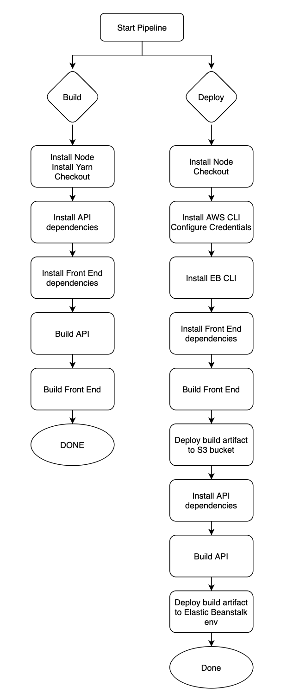

# The project pipeline

## Project orbs

```
  node: circleci/node@5.0.2
  eb: circleci/aws-elastic-beanstalk@2.0.1
  aws-cli: circleci/aws-cli@3.1.1
```

## Project script

```json
"scripts": {
    "frontend:install": "cd udagram/udagram-frontend && npm install -f",
    "frontend:build": "cd udagram/udagram-frontend && npm run build",
    "frontend:deploy": "cd udagram/udagram-frontend && npm run deploy",
    "backend:install": "cd udagram/udagram-api && npm install .",
    "backend:build": "cd udagram/udagram-api && npm run build",
    "backend:deploy": "cd udagram/udagram-api && npm run deploy",
    "deploy": "npm run backend:deploy && npm run frontend:deploy"
}
```

## Project Job

### Build

1. Install the node `node-version: '14.15'`
2. Checkout source code from github
3. Run Install Front-End Dependencies

   ```
   npm run frontend:install
   ```

4. Run Install API Dependencies

   ```
   npm run backend:install
   ```

5. Run Front-End Build

   ```
   npm run frontend:build
   ```

6. Run API Build

   ```
   npm run backend:build
   ```

### Hold

Hold the build of `main` branch to get approval. After the build is approved, run deploy job.

### Deploy

Run the deploy job:

1. Install the node `node-version: '14.15'`
2. Setup Elastic Beanstalk `eb/setup`
3. Setup AWS CLI `aws-cli/setup`
4. Checkout source code from github
5. Run Deploy App (Install, build and deploy both apps)

   ```
   npm run deploy
   ```

---
## Diagram

