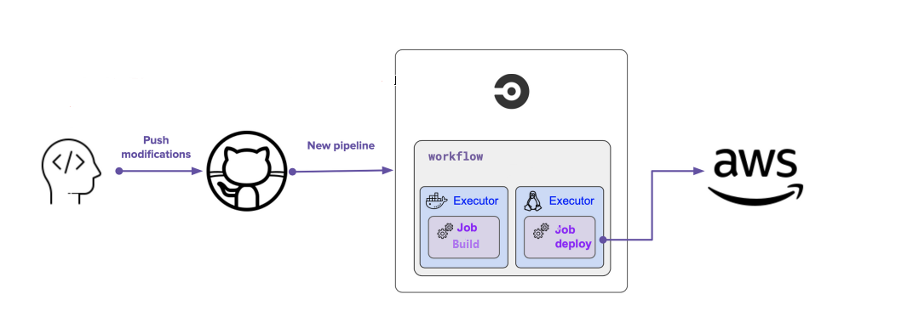

# The Udagram pipeline
This document outlines the pipeline for building and deploying a project using CircleCI.
## Project orbs
Orbs are reusable packages of CircleCI configuration that can be shared across projects. This project uses the following orbs:
```
  node: circleci/node@5.0.2
  eb: circleci/aws-elastic-beanstalk@2.0.1
  aws-cli: circleci/aws-cli@3.1.1
```

## Project script
The project has several scripts defined in the `package.json` file to automate common tasks such as installing dependencies, building the project, and deploying it to AWS Elastic Beanstalk:
```json
"scripts": {
    "frontend:install": "cd udagram/udagram-frontend && npm install -f",
    "frontend:build": "cd udagram/udagram-frontend && npm run build",
    "frontend:deploy": "cd udagram/udagram-frontend && npm run deploy",
    "backend:install": "cd udagram/udagram-api && npm install .",
    "backend:build": "cd udagram/udagram-api && npm run build",
    "backend:deploy": "cd udagram/udagram-api && npm run deploy",
    "deploy": "npm run backend:deploy && npm run frontend:deploy"
}
```

## Project Job
The pipeline consists of several jobs that are run in sequence to build and deploy the project.
### Build

1. Install the node `node-version: '14.15'`
2. Checkout source code from github
3. Run Install Front-End Dependencies

   ```
   npm run frontend:install
   ```

4. Run Install API Dependencies

   ```
   npm run backend:install
   ```

5. Run Front-End Build

   ```
   npm run frontend:build
   ```

6. Run API Build

   ```
   npm run backend:build
   ```

### Hold

The hold job is used to pause the pipeline and wait for manual approval before continuing. This is useful when you want to review the build before deploying it to production.

### Deploy

Run the deploy job:

1. Install the node `node/install`
2. Setup Elastic Beanstalk `eb/setup`
3. Setup AWS CLI `aws-cli/setup`
4. Checkout source code from github
5. Run Deploy App (Install, build and deploy both apps)

   ```
   npm run deploy
   ```

---
## Diagram
Here is a diagram that illustrates the pipeline:
