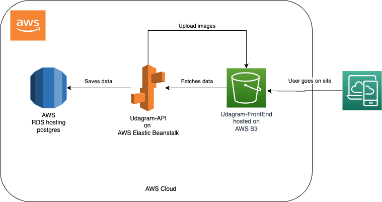

## Overview

Our system consists of three main components:

1. **Front-end:** The user interface of our application is hosted in an Amazon S3 bucket. This allows us to easily store and serve static files such as HTML, CSS, and JavaScript.

2. **API:** The back-end of our application is an API that is compressed and deployed using AWS Elastic Beanstalk. This service automatically handles the deployment, scaling, and monitoring of our application.

3. **Database:** Our data is stored in a Postgres instance on AWS RDS. This service provides a scalable and managed database solution for our application.

## Architecture Diagram

This diagram shows how the different components of our system interact with each other. The front-end sends requests to the API, which processes the data and interacts with the database to retrieve or store information.

